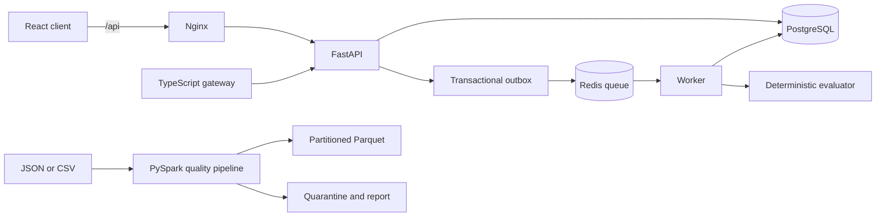

# OpenEval Systems Lab

A public, standalone systems project for task processing and deterministic software evaluation. It includes a FastAPI service, PostgreSQL state, Redis work queue, worker, TypeScript gateway, React client, and a separate PySpark quality pipeline. All fixtures are synthetic.

## Architecture



The worker publishes pending outbox rows to Redis, claims queued tasks under a database row lock, and records each state transition. It retries timeouts with bounded backoff and moves permanent failures to `dead_letter`. Replayed queue messages are ignored after a task leaves `queued`.

## Run locally

Requirements: Git, Docker Engine with the Compose plugin, and `curl` for the API examples. From a fresh clone, copy `.env.example` to `.env` (PowerShell: `Copy-Item .env.example .env`; macOS/Linux: `cp .env.example .env`), set a long random `API_TOKEN`, and set `POSTGRES_PASSWORD` to a local password. The supplied development defaults are suitable only for a local machine. Start the stack from the repository root:

```bash
docker compose -f infra/docker/compose.yml up --build -d --wait
```

Open `http://localhost:8080` and enter the configured token. The FastAPI documentation is at `http://localhost:8000/docs`. The TypeScript gateway listens at `http://localhost:3000` on loopback. All task endpoints require the bearer token.

```bash
curl -X POST http://localhost:8000/tasks \
  -H "Authorization: Bearer ${API_TOKEN}" \
  -H 'Idempotency-Key: demo-001' \
  -H 'Content-Type: application/json' \
  -d '{"scenario":"webhook_once","input":{"events":[{"id":"a","amount":10},{"id":"a","amount":10}]}}'

curl -X POST http://localhost:8000/tasks/TASK_ID/submit \
  -H "Authorization: Bearer ${API_TOKEN}" \
  -H 'Content-Type: application/json' \
  -d '{"implementation":"golden","inject_failure":"none"}'

curl http://localhost:8000/tasks/TASK_ID/result -H "Authorization: Bearer ${API_TOKEN}"
```

Use `defective_duplicate` or `defective_validation` to see failing checks, or `cpp_golden` to run the C++17 implementation through the worker's compiled evaluator. Use `transient`, `timeout`, or `invalid_output` for recovery scenarios. Failed checks receive a rule based local mock code review with source references. The score is fixture based and deterministic; it is a **reproducible RL-style software evaluation environment**, not a research reinforcement learning system or an LLM judge. See [C++ evaluator build and benchmark instructions](algorithms/README.md#c-golden-evaluator).

## Data pipeline

Install Java 17 and `pip install -r data-pipeline/requirements.txt`. The input is a full snapshot; each run replaces the Parquet and quarantine outputs. The sample contains 5 records: 2 valid, 2 invalid, and 1 duplicate. Run:

```bash
python data-pipeline/pyspark/pipeline.py --input data-pipeline/sample-data/trades.jsonl --output data-pipeline/output --quarantine data-pipeline/quarantine --report data-pipeline/reports/sample.json
```

Or build `docker build -f data-pipeline/Dockerfile -t openeval-pipeline .` and run it with the repository mounted at `/workspace`.

The pipeline validates required fields, quarantines malformed or conflicting rows, deduplicates by event ID, writes `symbol/year/month` Parquet partitions, and reconciles counts. See [schema](data-pipeline/schemas/trade.schema.json) and [Athena table template](data-pipeline/athena/create_table.sql). The Athena query and S3 upload require your own account and bucket.

## Verification

Install Python 3.11 and dependencies for local unit tests (the integration tests need the running Compose stack and the same `API_TOKEN` as `.env`):

```bash
python -m venv .venv
# macOS/Linux: source .venv/bin/activate
# Windows PowerShell: .venv\Scripts\Activate.ps1
python -m pip install -r services/api-python/requirements.txt
```

The commands below are run from the repository root unless a `cd` is shown. `npm ci` installs the checked-in lockfile versions.

```bash
python -m pytest tests/unit -q
cd services/api-typescript && npm ci && npm run build && npm test
cd ../../client && npm ci && npm run build
cd .. && API_TOKEN=YOUR_TOKEN python -m pytest tests/integration -q
python -m pytest tests/unit/test_pipeline.py -q
```

On Windows PowerShell, set `$env:API_TOKEN='YOUR_TOKEN'` before running `python -m pytest tests/integration -q`. Start the stack with `docker compose -f infra/docker/compose.yml up --build -d --wait` first. CI builds the TypeScript projects and containers, runs evaluator unit and workflow integration tests, and runs the PySpark sample test. See [CI](.github/workflows/ci.yml).

Run the fixed in-process Python evaluator workload with `python scripts/benchmark_evaluator.py`. It emits one JSON record with workload size, event counts, Python/platform versions, elapsed time and throughput. Repeat it to observe local variability; the result is not API or distributed throughput evidence. See [recorded benchmark runs and limits](docs/BENCHMARKS.md).

## Repository map

- `services/api-python`: typed REST API, state model, authentication, validation, outbox.
- `services/worker`: Redis queue consumer, retries, recovery, structured logs.
- `services/evaluator`: golden and defective variants, deterministic checks.
- `algorithms`: C++17 deterministic evaluator and repeatable benchmark.
- `services/api-typescript`: strict TypeScript client and Express gateway.
- `client`: React task dashboard.
- `data-pipeline`: synthetic trade fixtures and PySpark job.
- `scenarios`: evaluation and failure case documentation.
- `infra`: Compose and AWS deployment templates.
- `docs`: architecture, ADR, runbook, security, incident, benchmarks.

See the [demo script and technical walkthrough](docs/DEMO.md) for a recorded presentation plan.

## Status and limits

Local setup is designed for one demo tenant and synthetic data. The bearer token is shared, rate limiting is per proxy IP, database tables are created at startup without migrations, and the evaluator does not execute untrusted submitted code. Cloud deployment and performance claims require running the supplied configuration and recording evidence. No employer code, data, or infrastructure is included.
